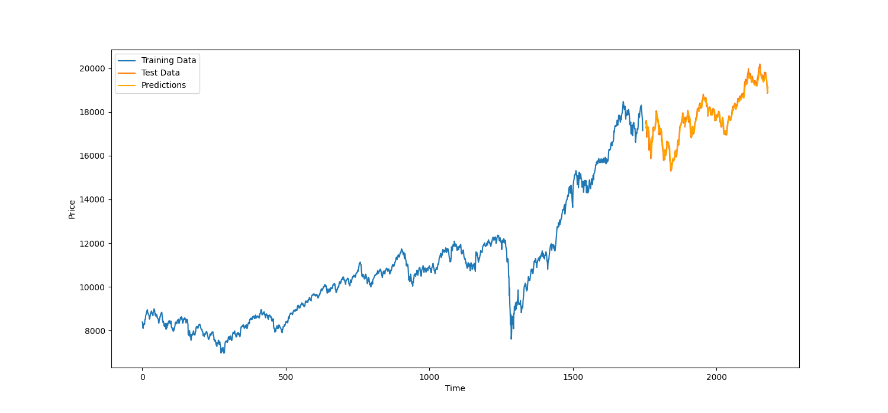

# IndexPriceForecast-LSTM

## Overview
This project is designed to predict future price values of the NIFTY 50 index using a Long Short-Term Memory (LSTM) neural network implemented in PyTorch. It showcases the application of deep learning techniques in financial time series forecasting.

## Features
- Logistic Regression implementation from scratch
- Utilizes Stochastic Gradient Descent for optimization
- Evaluation using ROC AUC score and confusion matrix

## How to Run
1. Clone this repository.
2. Install the dependencies: `pip install -r requirements.txt`.
3. Run `python LSTM_price_pred.py` to train the model and make predictions.

## Requirements
- PyTorch
- NumPy
- Pandas
- Scikit-learn (for data scaling)
- Matplotlib (for visualization)